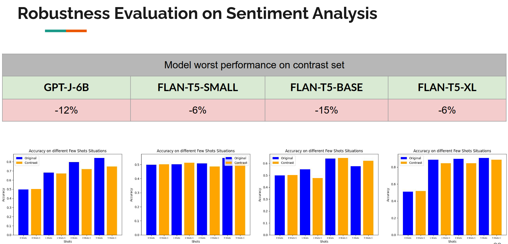

# Large Language Models (LLMs) Robustness Evaluation on Sentiment Analysis task

## Overview :label:
This project aims to assess the robustness of several Large Language Models (LLMs) in the task of Sentiment Analysis. The evaluation is conducted on various models, including ***GPT-J-6B***, ***FLAN-T5-small***, ***FLANT-T5-base***, and ***FLANT-T5-xl***. 
The evaluation process involves assessing these models on the ***IMDB dataset*** and its [contrastive set](https://arxiv.org/abs/2004.02709) available at [allenai/contrast-sets](https://github.com/allenai/contrast-sets).

## Robustness Definition :books:
In the context of LLMs, Robustness refer to the models’ ability to consistently maintain their performance and exhibit reliable and coherent behavior even in the presence of challenges, variation, or perturbation introduced to their input.

This encompasses the capacity of LLMs to effectively handle and resist adversarial inputs or unexpected shifts in the input distribution.

A robust LLM should demonstrate resilience against noise, uncertainties, and potential attacks from malicious users, ensuring that its outputs remain trustworthy and meaningful across a range of conditions.

Assessing the robustness of LLMs involves evaluating the stability and reliability of their outputs under various adverse and difficult circumstances.

### Adversarial Perturbation :alien:
Unlike images, in the context of Natural Language Processing (NLP), perturbation refers to any form of alteration or manipulation introduced to textual data, such as adding noise, changing words or syntax.
In the text domain, universal perturbations are commonly categorized into:
- **character-level**, 
- **word-level**, 
- **sentence-level**

In this evaluation, the original and clear set is the **IMDB** reviews dataset and the perturbed set is its relative [contrastive set](https://arxiv.org/abs/2004.02709) available at [allenai/contrast-sets](https://github.com/allenai/contrast-sets).

## Project Structure :file_folder:
- `FLAN-T5_eval.ipynb`: Colab notebook with scripts for evaluating FLAN models.
- `GPT-J-6B_eval.ipynb`: Colab notebook with scripts for evaluating GPT-J-6B model.
- There is a folder associated with each evaluation.
- `Dataset`: This folder contains the original and contrast sample for the evaluation.
- `Plots`: This folder contains various comparison plots generated during the evaluation process.

## Evaluation Methodology
The models are evaluated under `zero-shot`, `1-shot`, `3-shot`, and `5-shot` settings. 
The evaluation scripts assess the models' performance on the IMDB dataset and its contrastive set to gauge their robustness in sentiment analysis tasks.

### Evaluation results

## How to Use
1. Clone the repository to your local machine.
2. Navigate to the evaluation notebooks.
3. Execute the evaluation scripts.
4. View the evaluation results in the notebook.
5. Explore comparison plots in the `Plots` folder to analyze the performance of different models.
